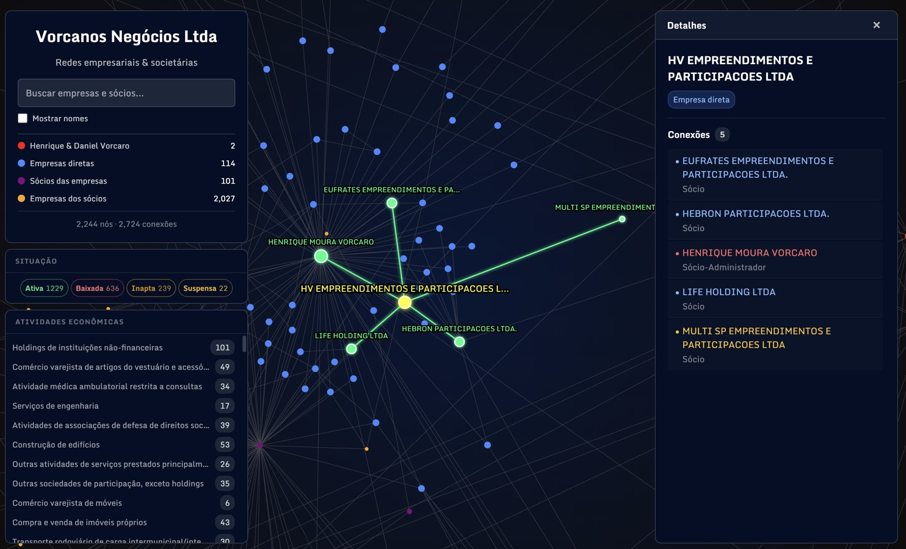

# Família Vorcaro — Redes Societárias

<p align="center">
  
</p>

Visualização interativa da rede societária da família Vorcaro em dois graus: as empresas onde Daniel, Henrique, Natalia, Aline e Felipe Vorcaro são sócios, os demais sócios dessas empresas, e as outras empresas onde esses sócios participam.

O grafo é renderizado em canvas com simulação de forças (d3-force) rodando em Web Worker, permitindo explorar conexões entre milhares de nós com performance fluida. Clicar em qualquer nó revela suas conexões diretas, o tipo de vínculo societário (sócio, administrador, diretor etc.) e permite navegar de nó em nó.

## O que mostra

| Cor | Nó |
|-----|----|
| Vermelho | Daniel, Henrique, Natalia, Aline & Felipe Vorcaro |
| Azul | Empresas onde são sócios diretos |
| Roxo | Demais sócios dessas empresas |
| Laranja | Empresas dos sócios |

## Stack

- **Dados**: CNPJ público, processado via Python (`generate_network.py`)
- **Visualização**: d3-force + Canvas 2D (dual canvas — links e nós em camadas separadas)
- **Física**: Web Worker dedicado (`simulation-worker.js`) — posições transferidas via `Float32Array` sem cópia
- **Build**: Bun — tree-shaking do d3, bundle principal + worker compilados em paralelo
- **Deploy**: GitHub Actions → GitHub Pages

## Funcionalidades

- **Modo luz** — botão ☀ alterna entre fundo escuro e claro com efeitos de brilho nos links
- **Busca com clear e contagem** — campo de busca exibe botão × para limpar e contador de resultados encontrados, alinhados ao centro vertical do input
- **Painel CNAE** — lista com virtual scrolling (apenas linhas visíveis no DOM)
- **Viewport culling** — links e nós fora da área visível são ignorados no desenho
- **Toggle "Empresas dos sócios"** — ativa/desativa os nós laranja (empresas dos demais sócios) para reduzir ruído visual no grafo
- **Hover tooltip** — ao passar o mouse sobre qualquer nó exibe nome e tipo sem precisar clicar
- **Navegação com histórico** — back/forward entre nós visitados na sessão
- **Filtro por status** — painel lateral filtra nós por categoria (família Vorcaro, empresa direta, sócio, empresa do sócio)
- **Glow verde em busca/CNAE** — highlight visual nos resultados ativos da busca e do filtro CNAE
- **Deep link via `?n=`** — URL com parâmetro seleciona e centraliza automaticamente um nó ao carregar (ex: `?n=NOME+DO+NO`)
- **Mobile bottom sheet** — painéis de detalhes e CNAE deslizam de baixo para cima em telas pequenas com transição animada
- **Painel de detalhes fixo** — nome do nó permanece visível ao rolar a lista de conexões; apenas a lista scrolla
- **Badges de contagem inteligentes** — painel de detalhes exibe badges "N empresas" e/ou "N sócios" calculados a partir dos vizinhos reais de cada nó, substituindo o antigo cabeçalho estático "Conexões N"

## Rodar

```bash
bun install
bun run build   # gera dist/ (bundle.js + simulation-worker.js)
# abra index.html no navegador
```

Para desenvolvimento com rebuild ao salvar:

```bash
bun run dev     # → http://localhost:5173
```
